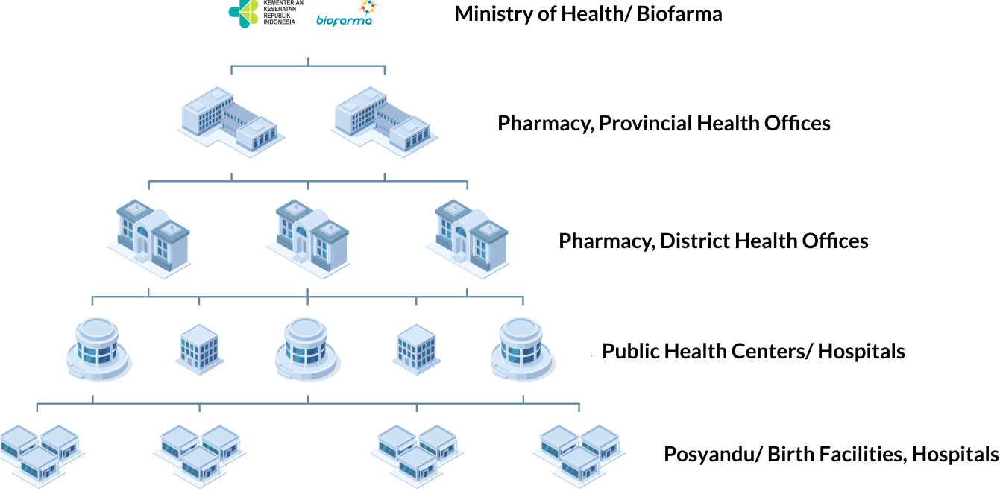

# Ministry of Health Healthcare System Overview

_Last updated: 01 Sep 2025_

## Table of Contents
- [About](#about)
- [Purpose](#purpose)
- [Materials Supply Chain Entity Levelling](#materials-supply-chain-entity-levelling)
- [Health Care Entity Levels](#health-care-entity-levels)
- [Program List](#program-list)
---

## About

A program is a structured health initiative designed to address specific diseases or health conditions by managing and distributing critical resources such as vaccines, drugs, and medical supplies. These programs are aligned with the needs of the healthcare system and the communities they serve, aiming to reduce the disease burden, improve access to treatment, and promote public health.

Implemented through collaboration between public health authorities, healthcare providers, and logistical systems, programs not only deliver care but also contribute to strengthening the overall health system, enhancing disease surveillance, and ensuring equitable access to essential services.

An essential component of these programs is the effective management of materials. Depending on the complexity and requirements of each program, materials may be tracked using either a non-hierarchical or hierarchical approach. Non-hierarchical systems focus on high-level tracking, such as brand names, while hierarchical systems offer more granular data by linking brand names to active substances and dosage information.

This structured tracking enables better monitoring, quality control, and informed decision-making in the distribution and utilisation of medical resources.

Supporting these efforts is a multi-tiered healthcare entity structure that governs the flow of materials through the supply chain. This entity hierarchy begins at the national level and extends to provincial, district, and local healthcare facilities, ensuring a coordinated and systematic distribution process.

Each level plays a defined role in managing the movement, storage, and delivery of health materials, which is crucial to maintaining the integrity and availability of supplies, especially in remote or underserved regions. This integration of program design, material management, and entity coordination forms the backbone of effective healthcare delivery systems.

---

## Purpose

The overarching aim of each program is to improve public health by effectively addressing specific health priorities to reach the goal:

- Delivering efficient treatments to reduce disease burden
- Ensuring equitable access to care, particularly in underserved communities
- Strengthening healthcare logistics and resource allocation systems
- Comprehensive tracking of the material supply chain

---

## Materials Supply Chain Entity Levelling

The **Materials Supply Chain Entity Levelling** refers to the procedural business process flow that governs the distribution of vaccines and other medical materials from the national level to end-users at local healthcare facilities.

This supply chain system ensures the systematic movement of vaccines, maintains their quality, and supports effective healthcare delivery through a structured, hierarchical approach.

In Indonesia, the supply chain for materials distribution operates through a well-defined hierarchy to ensure efficient delivery from central authorities to local healthcare facilities. The system maintains the integrity of vaccines and ensures equitable access nationwide.

At the core of this distribution process is the healthcare entity, which encompasses a range of organisations, including Health Offices at different levels, that manage the delivery of healthcare services and medical materials.

The Health Care Entity (HCE) Level comprises various hierarchical layers, beginning with the National Health Office, which oversees the distribution and allocation of resources at the national level, and extending to local health facilities.

Each level in this chain is responsible for managing the supply of vaccines and other essential medical supplies within its jurisdiction, ensuring that these materials reach healthcare providers and, ultimately, patients.

This structured, multi-level system ensures the quality of vaccines and consistently maintains healthcare services, particularly in remote areas.

---

## Health Care Entity Levels

The Health Care Entity Levels of the supply chain in Indonesia are as follows:

1. **Level 1**: Ministry of Health and Materials’ manufacturer (e.g. Biofarma)
2. **Level 2**: Provincial Health Offices and Pharmacy
3. **Level 3**: District Health Office and Pharmacy
4. **Level 4**: Public Health Centres and Regional Public Hospitals
5. **Level 5**: Posyandu (Birth Facilities) and Private Hospital

For each SMILE instance implemented, the Health Care Entity Level may vary between countries because each country has its own policy of organising healthcare services and distributing medical supplies.

---

## Program List

This program list is based on the programs that are planned to be implemented by the Ministry of Health of Indonesia.

The **bolded programs** are the current programs that are managed in **SMILE**. The list remains under review and will be updated regularly as the programs are further refined and expanded.

| Program Name | Activities | Material Type |
|-------------|-----------|---------------|
| **Immunization** | Rutin | Vaccine |
|  | BIAN | Vaccine |
|  | Umum | Vaccine |
|  | Covid-19 | Vaccine |
|  | Kampanye | Vaccine |
|  | Ori | Vaccine |
| Rabies | Rabies | Vaccine |
| Hepatitis | Hepatitis | Vaccine |
| Dengue | Dengue | Vaccine |
| Essential Medicine | PKD (Pelayanan Kesehatan Dasar) | Medicine |
| HIV | HIV | Medicine |
| Tuberculosis (TB) | Resistan Obat (RO) | Medicine |
|  | Sensitif Obat (SO) | Medicine |
|  | Terapi Pencegahan TB (TPT) | Medicine |
|  | Non-Obat Anti Tuberkulosis (Non-OAT) | Medicine |
| Malaria | Rutin | Medicine |
|  | MBS (Mass Blood Survey) | Medicine |
| Free Health Screening (PKG) | BMHP Skrining | Medicine |
| Anti-Venom | Anti-Venom | Medicine |
| Diarrhea | Diare | Medicine |
| Filariasis | Filariasis | Medicine |
| Nutrition | Gizi | Medicine |
| Mental Health | Keswa (Kesehatan Jiwa) | Medicine |
| Maternal and Child Health | KIA (Kesehatan Ibu dan Anak) | Medicine |
| Leprosy | Kusta | Medicine |
| Frambusia | Frambusia | Medicine |

For more information about configuring Programs and Activities managed in SMILE, please refer to **Master Data Service**.

